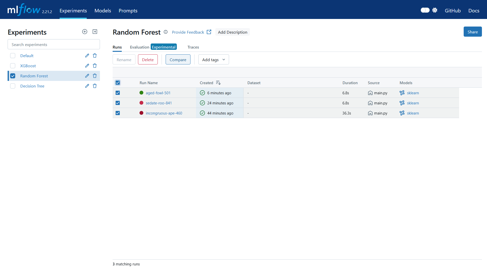

### Social Network Ads - Performance Prediction
## Project Overview
The project implements __Decision tree__,  __bagging__ and __boosting__ models to predict whether a user purchases a product after viewing its social network Ad.  
MLflow is used to handle the machine learning workflow. Options for python command line interface is provided to select which model to train and providing its hyperparameters.

## Dataset Information
### columns
- `Age` : Age of user
- `EstimatedSalary` : Salary of the user
- `Purchased` : Binary label
    - 0 : No
    - 1 : Yes

The dataset includes age and estimated salary of the user. The purchased column indicates weather the particular user with age and estimated salary have bought the product or not by viewing the social ads of the product .

Dataset: https://www.kaggle.com/datasets/shub99/social-network-ads

## Architecture
1. __Data Ingestion__ : The dataset is loaded from a given file path or url, or it is loaded from the default file path.  
2. __Preprocessing__ : Missing values are imputed using the train data median.
3. __Model Training__ : _Decision Tree_, _Random Forest_ and _XGBoost_ are confiugred to be trained on the data with hyperparameter tuning using _GridSearchCV_
4. __MLflow__ : MLflow is used for experiment tracking. The trained model, preprocessor, paramters and metrics are logged.
5. __argparse__ : `argparse` is used to write a command line interface for the project in which options are enabled to specify which model to train, hyperparameters and the path to the dataset.

### Command line argument flags
- `--path` , `-p` : (Optional). specify path or URL, else default path.
- `--auto` : This flag is used to specify which model to train. Automatically tunes the hyperparameters. It is not case sensitive.  
            Allowed values: `decisiontree`, `randomforest`, `xgboost`

The models can also be specified as subcommands, allowing their hyperparameters to be defined using the corresponding flags  

- __subcommands__ : [`decisiontree`, `randomforest`, `xgboost`] (case sensitive)

## Dependencies
- `pandas`
- `numpy`
- `seaborn`
- `matplotlib`
- `xgboost`
- `scikit-learn`
- `mlflow`

## Steps
### Installing required libraries
```
pip install pandas numpy seaborn matplotlib xgboost scikit-learn mlflow
```

### Training Models
```
python main.py --auto DecisionTree

python main.py --auto RandomForest

python main.py --auto XGBoost

python main.py randomforest

python main.py xgboost --learning_rate 0.1 --max_depth 5 -n 200

python main.py decisiontree -c entropy -s 3 -d
```

### MLflow
```
mlflow ui
```


### Serving the model using MLflow
MLflow can be used to serve the model as a REST API endpoint.  
Inferencing is done with a JSON POST request.   

The best model is registered from the MLflow ui.  
XGBoost was chosen as the best model because it had high Accuracy score and ROC-AUC score.  
 
The registered model can be served in a single command.  
```
mlflow models serve -m "models:/XGBoost/1" --port 5002 --env-manager local
```

The Model API can be inferred using any command line utilities, python libraries (like _requests_), or services like Postman.  
A POST request is sent to the _invocations_ path.  
The schema for sending the request can be looked from the MLflow UI inside artifacts.
